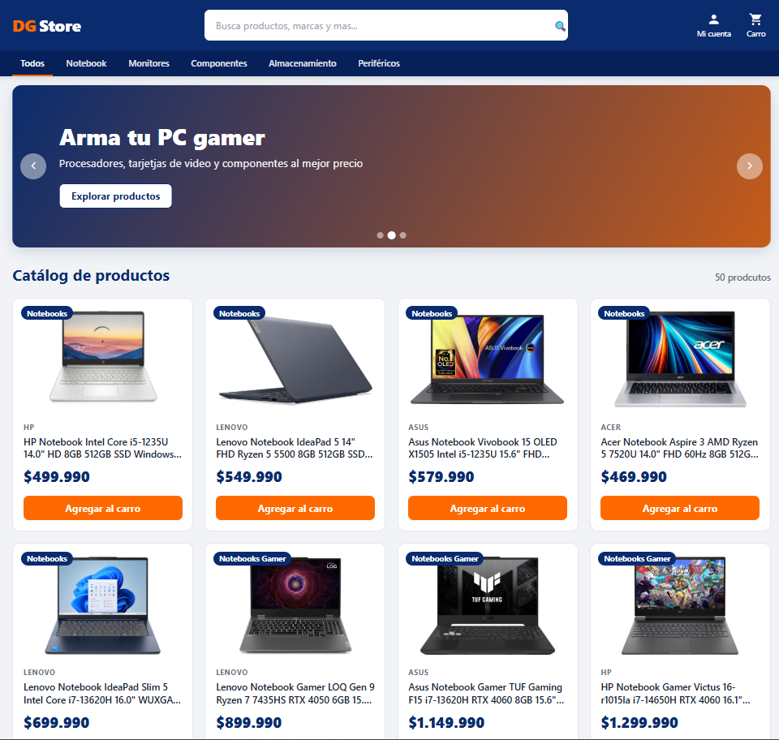
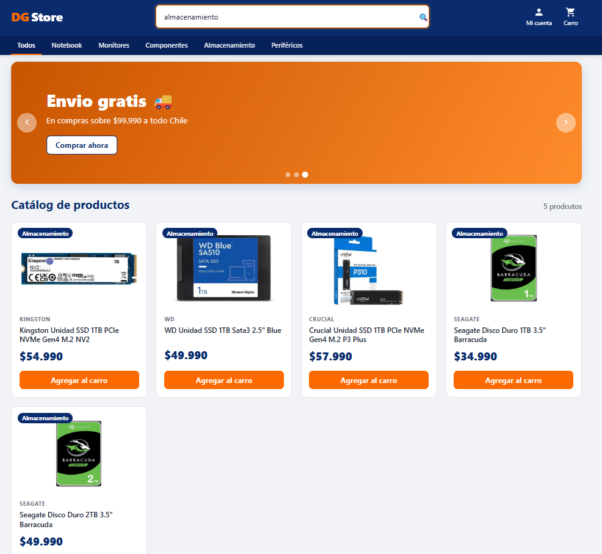

# 🛒 DG Store

Tienda online de tecnología hecha con React. Muestra un catálogo de productos
(notebooks, componentes, monitores, almacenamiento y periféricos) que se pueden
**buscar**, **filtrar por categoría** y **agregar a un carrito de compras**.

## 🧩 Componentes creados

- HeaderComponent
- HeroComponent
- SearchBarComponent
- CardComponent
- ProductListComponent
- CartComponent
- AccountMenuComponent
- ButtonComponent
- ImageComponent
- FooterComponent

## ▶️ Cómo ejecutar el proyecto

1. Instalar las dependencias:
   ```
   npm install
   ```
2. Iniciar el servidor de desarrollo:
   ```
   npm run dev
   ```
3. Abrir en el navegador la dirección que aparece (por ejemplo `http://localhost:5173`).

## 🛠️ Tecnologías usadas

- React
- Vite
- JavaScript
- CSS

## 📸 Capturas de pantalla

### Vista general de DG Store



