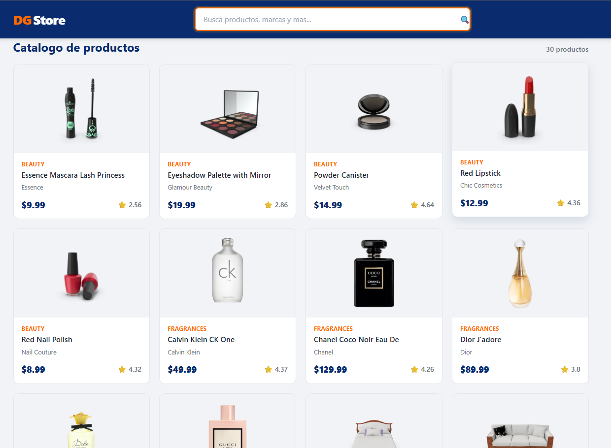
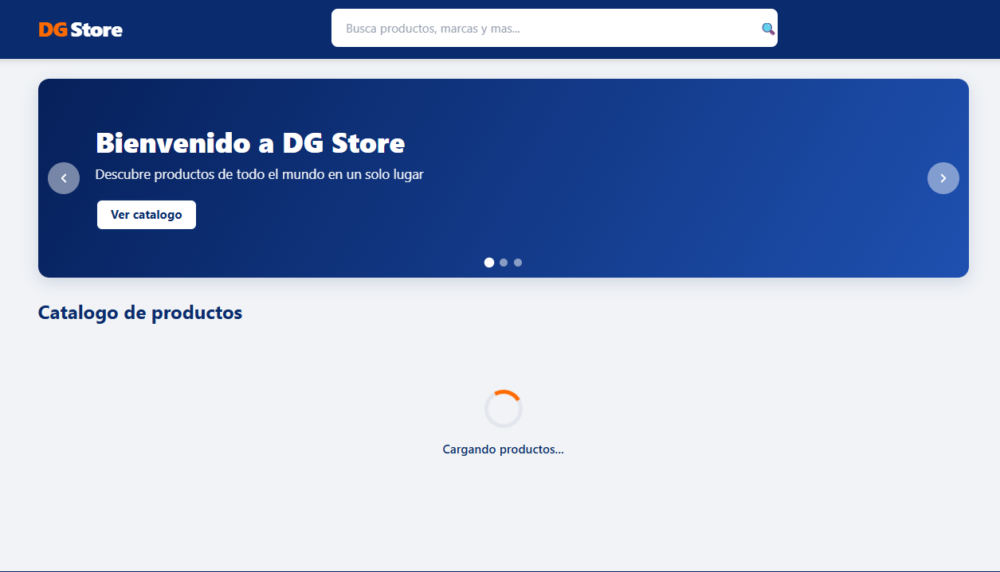
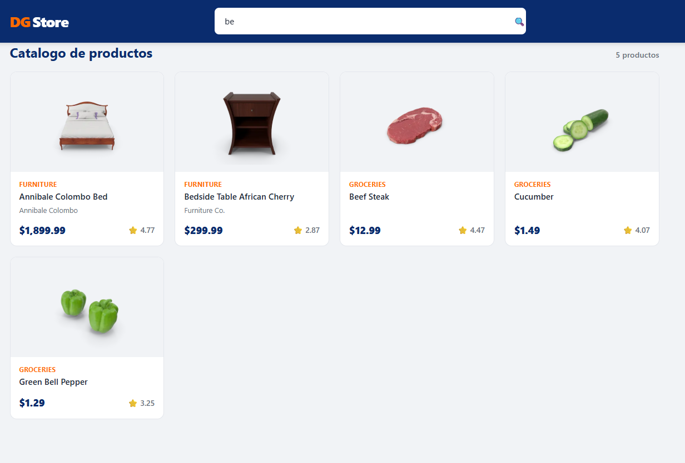
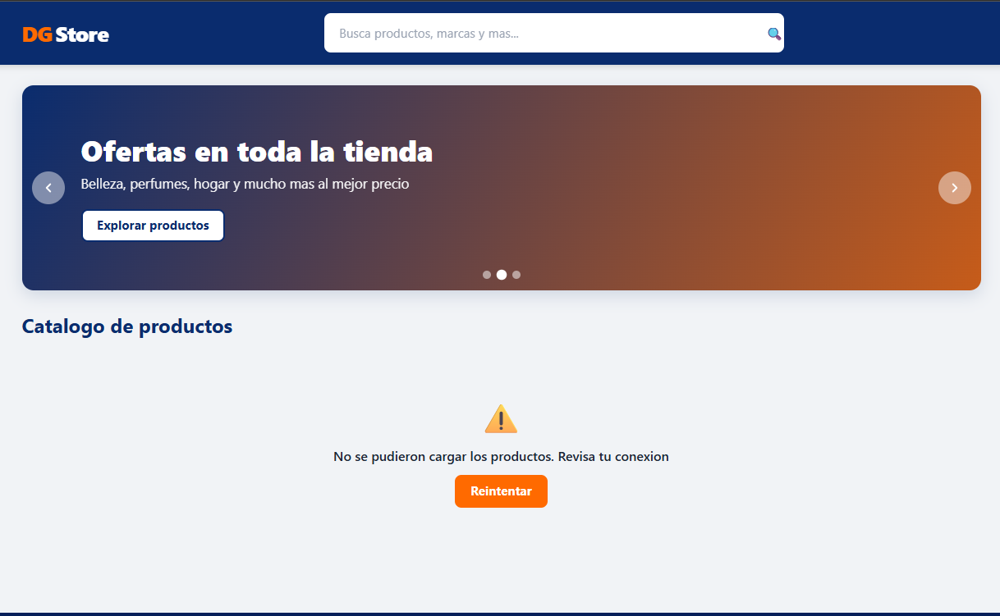

# 🛒 DG Store API

Tienda online hecha con React que **consume productos desde una API**
(`https://dummyjson.com/products`). Muestra estados de **carga** y **error**, y permite
**buscar productos por nombre**.

## 🧩 Componentes creados

- HeaderComponent
- HeroComponent
- SearchBarComponent
- ProductCardComponent
- ProductListComponent
- LoaderComponent
- ErrorMessageComponent
- FooterComponent
- ButtonComponent

## 🌐 Consumo de API

Los productos se obtienen con `fetch` dentro de `useEffect`, manejando 3 estados:
**loading** (cargando), **error** (si falla la API) y **products** (los datos).

## ▶️ Cómo ejecutar el proyecto

1. Instalar dependencias:
   
   npm install
   
2. Iniciar el servidor:
   
   npm run dev
   
3. Abrir la dirección que aparece (por ejemplo `http://localhost:5173`).

## 🛠️ Tecnologías usadas

- React
- Vite
- JavaScript
- CSS
- API: dummyjson.com

## 📸 Capturas de pantalla

### Vista general

### Cargando productos (loading)

### Búsqueda funcionando

### Error al cargar (sin conexión)
